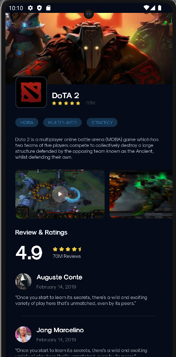

# Dota 2 MainScreen

## Описание проекта
Это проект экрана приложения, написанный на Kotlin c использованием Jetpack Compose. На экране присутствуют следующие элементы:

- **Шапка**: Заголовок и логотип Dota 2.
- **Тэги**: Категории и характеристики игры.
- **Скриншоты**: Скриншоты игры.
- **Отзывы и оценки**: Отзывы и оценки игры.
- **Кнопка "Установить"**: Для установки игры.

## Структура проекта
- **`MainActivity`**: Главный файл для компиляции всего приложения.
- **`DotaScreen`**:  Файл, где находится весь код экрана Dota 2.
- **`DotaScreenHeader`**: Лого и шапка экрана.
- **`Genres`**: Категии и характеристики игры.
- **`FeedPhoto`**: Отображение скриншотов игры.
- **`ReviewAndRating`**: Оценки игры.
- **`Comments`**: Комментарии. 
- **`ButtonInstall`**: Кнопка для установки.     
- **`photo`**: Фото приложения.

## Технологии
- Kotlin и Jetpack Compose

## Как использовать
1. Клонируйте репозиторий.
2. Откройте проект в вашей IDE.
3. Запустите проект и убедитесь, что у вас установлены все необходимые зависимости.

## Автор
Автор: Шереметьев Кирилл Алексеевич